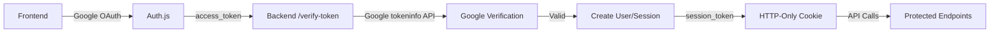

# Active Context

## Current State (Updated January 2025)

### **✅ COMPLETED: Secure Authentication Refactor**

The authentication system has been completely refactored with secure Auth.js implementation:

#### **Security Improvements**
- **Fixed Critical Vulnerability**: Removed insecure `/verify-google-user` endpoint that blindly trusted frontend data
- **Added Secure Verification**: New `/verify-token` endpoint uses Google's official tokeninfo API for proper token validation
- **Eliminated Client Storage**: Removed all localStorage usage in favor of secure HTTP-only cookies
- **Extended Token Life**: Increased access token expiry to 6 hours (eliminating refresh token complexity)

#### **Architecture Simplification**
- **Backend Changes**: Removed insecure endpoints (`/verify-google-user`, `/refresh`, `/dev-login`)
- **Frontend Changes**: Simplified Auth.js configuration to use only Google OAuth
- **Service Layer**: Streamlined AuthService with only secure Google token verification method
- **Dead Code Removal**: Cleaned up all unused schemas, test files, and service methods

#### **Testing & Quality**
- **All Tests Passing**: 305 tests pass after dead code cleanup
- **Linting Clean**: No code style issues remaining
- **Schema Validation**: Fixed UserProfileResponse field mapping
- **HTTP Status Codes**: Corrected test expectations (403 for missing auth, 401 for invalid credentials)

### **Current System Status**

#### **Backend API (Secure)**
- **Authentication Endpoint**: `/api/v1/auth/verify-token` - Securely verifies Google OAuth tokens
- **Session Management**: `/api/v1/auth/me` - Returns user session info
- **Token Validation**: `/api/v1/auth/validate` - Validates JWT tokens
- **Logout**: `/api/v1/auth/logout` - Client-side token invalidation

#### **Frontend Integration**
- **Auth.js Provider**: Configured for Google OAuth only
- **Secure Callbacks**: JWT sessions stored in HTTP-only cookies
- **API Integration**: Uses session tokens for backend API calls
- **No Refresh Logic**: Simplified auth flow without complex token rotation

#### **Security Architecture**

### **Next Steps**

The authentication system is now complete and secure. The project is ready for:

1. **Frontend Integration Testing**: Test the full OAuth flow with the new secure endpoints
2. **Production Deployment**: Deploy with proper Google OAuth credentials
3. **Feature Development**: Continue building workout tracking features with secure authentication

### **Key Technical Decisions**

- **No Development Login**: Removed insecure dev login to enforce proper OAuth in all environments
- **Session Token Pattern**: Simplified token management with 6-hour expiry
- **Repository Pattern**: Maintained strict data access through repository classes
- **Dependency Injection**: Used FastAPI's DI system for all auth services

The authentication refactor represents a complete security overhaul that maintains the same user experience while providing robust protection against common OAuth vulnerabilities.
