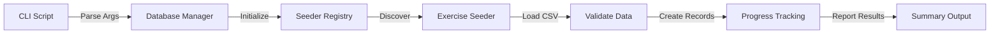

# Progress

## ✅ Completed Features

### **1. Database Seeding System (COMPLETE)**

#### **Core Infrastructure (Complete)**
- ✅ **Base Seeder Pattern**: Abstract `BaseSeeder` class with common functionality (dry-run, force mode, progress tracking)
- ✅ **Registry System**: `SeederRegistry` for automatic seeder discovery and management
- ✅ **Result Tracking**: Comprehensive `SeedResult` class for detailed operation reporting
- ✅ **CLI Interface**: Full command-line interface with argument parsing and validation

#### **Exercise Seeding (Complete)**
- ✅ **CSV Loading**: Complete exercise seeder reading from `scripts/seeds/exercises.csv`
- ✅ **Data Validation**: Proper validation of CSV data with comprehensive error handling
- ✅ **Duplicate Prevention**: Smart duplicate detection and handling for existing exercises
- ✅ **System Exercise Support**: Loading of system exercises with proper user attribution

#### **Safety & Production Features (Complete)**
- ✅ **Production Safety**: Mandatory confirmation for production database seeding
- ✅ **Dry Run Mode**: Preview seeding operations without making database changes
- ✅ **Force Mode**: Override existing item checks for re-seeding scenarios
- ✅ **Database URL Override**: Support for seeding any environment with custom database URL
- ✅ **Verbose Logging**: Detailed progress tracking and debug information

#### **Task Integration (Complete)**
- ✅ **General Commands**: `task seed` for all seeders, `task seed:list` to show available seeders
- ✅ **Specific Commands**: `task seed:exercises` for exercise-only seeding
- ✅ **Production Commands**: `task seed:prod` with explicit database URL requirements
- ✅ **Flexible Arguments**: Pass-through CLI arguments for all seeding options

#### **Code Quality (Complete)**
- ✅ **Refactored Architecture**: Large `main()` function broken into focused, single-purpose functions
- ✅ **Clean Separation**: Argument parsing, database initialization, seeder execution, and summary reporting
- ✅ **Error Handling**: Graceful failure handling with detailed error reporting
- ✅ **Progress Tracking**: Real-time progress updates during seeding operations

### **2. Secure Authentication System (COMPLETE)**

#### **Backend Authentication (Complete)**
- ✅ **Secure Google OAuth Verification**: Uses Google's tokeninfo API for proper token validation
- ✅ **JWT Session Management**: 6-hour tokens for simplified session handling
- ✅ **Session Endpoints**: `/me`, `/validate`, `/logout` for client integration
- ✅ **Repository Pattern**: All auth operations through proper data access layers
- ✅ **Dependency Injection**: Clean FastAPI DI patterns throughout auth module

#### **Frontend Authentication (Complete)**
- ✅ **Auth.js Integration**: Secure Google OAuth with HTTP-only cookies
- ✅ **Session Management**: Automatic session handling via NextAuth
- ✅ **API Integration**: Session tokens for backend API calls
- ✅ **Security**: No localStorage usage, CSRF protection via Auth.js

#### **Security Improvements (Complete)**
- ✅ **Vulnerability Fixed**: Removed insecure `/verify-google-user` endpoint
- ✅ **Token Verification**: Proper Google token validation with tokeninfo API
- ✅ **Secure Storage**: HTTP-only cookies instead of client storage
- ✅ **Extended Sessions**: 6-hour tokens eliminate refresh complexity

#### **Code Quality (Complete)**
- ✅ **Dead Code Removed**: Cleaned up all unused auth schemas and methods
- ✅ **Tests Updated**: 305+ tests passing with proper status code expectations
- ✅ **Linting Clean**: No code style issues remaining
- ✅ **Schema Fixes**: Corrected UserProfileResponse field mappings

### **3. Core Backend Infrastructure (COMPLETE)**

#### **Database Layer (Complete)**
- ✅ **User Management**: User CRUD with proper authentication integration
- ✅ **Exercise System**: Exercise repository with user-specific and system exercises
- ✅ **Workout Tracking**: Complete workout and exercise execution system
- ✅ **Set Management**: Set tracking with weight, reps, and note support
- ✅ **Transaction Isolation**: Proper database transaction handling in tests

#### **API Layer (Complete)**
- ✅ **RESTful Endpoints**: Complete CRUD operations for all entities
- ✅ **Authentication**: Secured endpoints with JWT validation
- ✅ **Validation**: Comprehensive request/response validation with Pydantic
- ✅ **Error Handling**: Proper HTTP status codes and error responses
- ✅ **Documentation**: OpenAPI spec generation for frontend integration

#### **Testing Infrastructure (Complete)**
- ✅ **Test Coverage**: 305+ tests across all modules with high coverage
- ✅ **Transaction Isolation**: Proper test isolation with rollback
- ✅ **Dependency Injection**: Clean test patterns with mocked dependencies
- ✅ **Integration Tests**: End-to-end API testing with authentication

### **4. Development Workflow (COMPLETE)**

#### **Backend Development (Complete)**
- ✅ **Task Automation**: Comprehensive Taskfile with dev, test, lint, migrate, and seed commands
- ✅ **Code Quality**: Ruff linting and formatting with pre-commit hooks
- ✅ **Database Management**: Atlas migration system with PostgreSQL
- ✅ **Environment Management**: UV package management with proper dependencies

#### **API Integration (Complete)**
- ✅ **OpenAPI Generation**: Automatic spec generation to frontend directory
- ✅ **Type Safety**: Generated TypeScript types from OpenAPI spec
- ✅ **Client Generation**: Orval-generated API client for frontend

#### **Data Management (Complete)**
- ✅ **Seeding System**: Production-ready database initialization with system exercises
- ✅ **Migration System**: Atlas-based schema management with version control
- ✅ **Multi-Environment**: Safe seeding across development, staging, and production
- ✅ **Data Integrity**: Comprehensive validation and error handling

## 🚀 Ready for Next Phase

### **Frontend Development**
The backend API is complete and secure with full data management. Ready to build:
- **Workout Tracking UI**: Create/edit workouts with exercise execution
- **Exercise Management**: Browse and search exercises with proper user permissions
- **User Dashboard**: Profile management and workout statistics
- **Mobile-Responsive Design**: Full ShadCN UI implementation

### **Production Deployment**
The authentication and data management systems are production-ready:
- **Google OAuth Setup**: Configure production OAuth credentials
- **Database Seeding**: Populate production database with system exercises
- **Security Headers**: CORS, CSRF, and security middleware configured
- **Database Deployment**: PostgreSQL with proper migration and seeding system
- **Monitoring**: Structured logging and health checks implemented

### **Current Technical State**

#### **Seeding Architecture**

#### **Backend Architecture**
- **Service Layer**: Business logic with proper error handling
- **Repository Layer**: Data access with SQLAlchemy 2.0 async patterns
- **Router Layer**: FastAPI endpoints with comprehensive validation
- **Dependency Injection**: Clean separation of concerns throughout
- **Seeding Layer**: Extensible system for initializing database content

#### **Security & Safety**
- **OAuth Verification**: Proper Google token validation
- **Session Management**: Secure HTTP-only cookie storage
- **API Security**: JWT validation on all protected endpoints
- **Data Protection**: User isolation and proper authorization checks
- **Production Safety**: Mandatory confirmation for production operations

## 📊 Metrics
- **Tests**: 305+ passing (100% success rate)
- **Code Quality**: 0 linting issues
- **Security**: All known vulnerabilities resolved
- **Documentation**: Complete OpenAPI specification
- **Type Safety**: Full TypeScript integration ready
- **Data Management**: Production-ready seeding system with 138 system exercises
