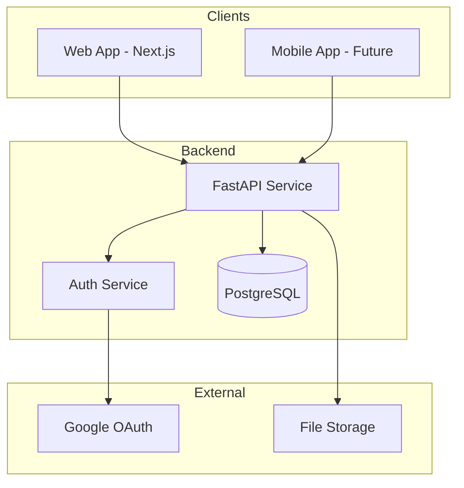

# System Patterns

## Architecture Overview

### System Architecture
Backend-first API design with future web and mobile clients.



### Backend Structure (Functional Cohesion)
```
src/
├── workout_api/
│   ├── __init__.py
│   ├── main.py              # FastAPI app setup
│   ├── config.py            # Settings management
│   ├── database.py          # Database connection
│   ├── auth/                # Auth domain
│   │   ├── models.py        # SQLAlchemy models
│   │   ├── schemas.py       # Pydantic schemas
│   │   ├── service.py       # Business logic
│   │   ├── router.py        # API endpoints
│   │   └── dependencies.py  # FastAPI dependencies
│   ├── exercises/           # Exercise domain
│   │   └── (same structure)
│   ├── workouts/            # Workout domain
│   │   └── (same structure)
│   └── shared/              # Minimal shared code
│       ├── base_model.py
│       └── exceptions.py
├── tests/
│   ├── conftest.py          # Test configuration
│   ├── auth/
│   ├── exercises/
│   └── workouts/
├── migrations/              # Atlas migrations
├── scripts/                 # Utility scripts
└── Taskfile.yml            # Task automation
```

## Core Patterns

### Repository Pattern
Encapsulate all database operations and enforce strict data access boundaries:

```python
class ExerciseRepository:
    def __init__(self, session: AsyncSession):
        self.session = session

    async def get_by_id(self, id: int) -> Exercise | None:
        result = await self.session.get(Exercise, id)
        return result

    async def search(self, query: str) -> list[Exercise]:
        stmt = select(Exercise).where(
            Exercise.name.ilike(f"%{query}%")
        )
        result = await self.session.execute(stmt)
        return result.scalars().all()
```

**Critical Pattern Enforcement:**
- **NO direct database queries outside repositories** - Services must use repository methods
- **NO helper functions that bypass repositories** - All data access must go through the repository layer
- **Repository injection required** - Services receive repositories through constructor injection
- **Single source of truth** - Each entity type has one repository that handles all its database operations
- **NO raw SQL deletes** - Use ORM deletion with cascade relationships, never `session.execute(delete(Model)...)`

**Example of proper service layer usage:**
```python
class AuthService:
    def __init__(self, session: AsyncSession, jwt_manager: JWTManager, user_repository: UserRepository):
        self.session = session
        self.jwt_manager = jwt_manager
        self.user_repository = user_repository  # Injected repository

    async def authenticate_with_google(self, google_user_info: GoogleUserInfo):
        # Correct: Use repository methods
        user = await self.user_repository.get_by_google_id(google_user_info.google_id)

        if not user:
            existing_user = await self.user_repository.get_by_email(google_user_info.email)
            # ... business logic
```

**ORM Deletion Pattern (Required):**
```python
# ✅ CORRECT: ORM deletion with cascade relationships
async def upsert_exercise_execution(self, workout_id: int, exercise_id: int, data):
    if execution:
        # Delete existing sets using ORM (leverages cascade relationships)
        for existing_set in execution.sets:
            await self.session.delete(existing_set)

        execution.sets.clear()
        await self.session.flush()  # Ensure deletions are visible

# ❌ WRONG: Raw SQL delete bypasses ORM and cascade rules
async def upsert_exercise_execution(self, workout_id: int, exercise_id: int, data):
    if execution:
        await self.session.execute(
            delete(Set).where(and_(Set.workout_id == workout_id, Set.exercise_id == exercise_id))
        )
```

### Efficient Data Retrieval Pattern
**Use database-level operations for aggregations and distinct queries:**

```python
# ❌ WRONG: Fetching all records for simple aggregation
async def get_distinct_categories_inefficient(self, user_id: int | None = None):
    all_items = []
    page = 1
    while True:
        result = await self.search_all_items(page=page, size=100)
        all_items.extend(result.items)
        if len(result.items) < 100:
            break
        page += 1

    categories = list({item.category for item in all_items if item.category})
    return sorted(categories)

# ✅ CORRECT: Use database DISTINCT query
async def get_distinct_categories(self, user_id: int | None = None):
    stmt = select(Item.category).distinct()

    if user_id is not None:
        permission_filter = or_(
            Item.created_by_user_id == user_id,
            ~Item.is_user_created,  # System items
        )
        stmt = stmt.where(permission_filter)
    else:
        # Anonymous users can only see system items
        stmt = stmt.where(~Item.is_user_created)

    result = await self.session.execute(stmt)
    categories = [cat for cat in result.scalars().all() if cat]
    return sorted(categories)
```

**Benefits:**
- **99%+ performance improvement** - Single query vs potentially thousands
- **Proper permission boundaries** - Enforces user access controls at database level
- **Minimal memory usage** - Only retrieves needed data, not full objects
- **Correct security model** - Anonymous users only see appropriate data

### Service Layer Pattern
Business logic separate from data access:

```python
class ExerciseService:
    def __init__(self, repo: ExerciseRepository):
        self.repo = repo

    async def create_exercise(
        self,
        user_id: int,
        data: ExerciseCreate
    ) -> Exercise:
        # Business validation
        if await self._exercise_exists(data.name, user_id):
            raise DuplicateError("Exercise already exists")

        # Create via repository
        return await self.repo.create(data)
```

**Service Layer Responsibilities:**
- **Business logic only** - No direct database queries
- **Repository coordination** - Use repository methods for all data access
- **Transaction management** - Handle commits/rollbacks for complex operations
- **Exception translation** - Convert repository exceptions to business exceptions

**Repository Factory Pattern:**
```python
def get_auth_service(session: AsyncSession, jwt_manager: JWTManager) -> AuthService:
    """Factory function to create AuthService with proper dependencies."""
    user_repository = UserRepository(session)
    return AuthService(session, jwt_manager, user_repository)
```

### Dependency Injection (Enhanced)
Constructor injection with FastAPI's DI system:

#### Service Dependencies
```python
# dependencies.py
from functools import lru_cache
from typing import Annotated

@lru_cache
def get_jwt_manager(
    settings: Annotated[Settings, Depends(get_settings)]
) -> JWTManager:
    """Singleton JWT manager."""
    return JWTManager(settings)

@lru_cache
def get_google_oauth(
    settings: Annotated[Settings, Depends(get_settings)]
) -> GoogleOAuthManager:
    """Singleton OAuth manager."""
    return GoogleOAuthManager(settings)

# Type aliases for clean signatures
JWTManagerDep = Annotated[JWTManager, Depends(get_jwt_manager)]
GoogleOAuthDep = Annotated[GoogleOAuthManager, Depends(get_google_oauth)]
SessionDep = Annotated[AsyncSession, Depends(get_session)]
```

#### Service Construction
```python
# service.py
class AuthService:
    def __init__(
        self,
        session: AsyncSession,
        jwt_manager: JWTManager,
        google_oauth: GoogleOAuthManager
    ):
        self.session = session
        self.jwt_manager = jwt_manager
        self.google_oauth = google_oauth

# router.py
@router.post("/login")
async def login(
    session: SessionDep,
    jwt_manager: JWTManagerDep,
    google_oauth: GoogleOAuthDep,
):
    service = AuthService(session, jwt_manager, google_oauth)
    # Use service...
```

#### Interface Injection for Testing
```python
from typing import Protocol

class TimeProvider(Protocol):
    def now(self) -> datetime:
        ...

class DefaultTimeProvider:
    def now(self) -> datetime:
        return datetime.now(UTC)

class JWTManager:
    def __init__(
        self,
        settings: Settings,
        time_provider: TimeProvider | None = None
    ):
        self.settings = settings
        self.time_provider = time_provider or DefaultTimeProvider()
```

### Transaction Pattern
Ensure data consistency:
```python
async def create_workout_with_exercises(
    self,
    user_id: int,
    exercises: list[ExerciseData],
) -> Workout:
    async with self.session.begin():
        workout = await self.repo.create_workout(user_id)
        for exercise in exercises:
            await self.repo.add_exercise_execution(
                workout.id,
                exercise
            )
        return workout
    # Auto-commit on success, rollback on error
```

### Error Handling Pattern
Consistent error responses with exception chaining:
```python
# Custom exceptions
class AuthenticationError(Exception):
    """Base authentication error"""

class TokenExpiredError(AuthenticationError):
    """Token has expired"""

# Exception chaining
try:
    payload = jwt.decode(token, self.secret_key)
except JWTError as e:
    logger.error(f"JWT decode error: {e}")
    raise AuthenticationError("Invalid token") from e

# FastAPI exception handlers
@router.exception_handler(AuthenticationError)
async def auth_error_handler(request: Request, exc: AuthenticationError):
    return JSONResponse(
        status_code=401,
        content={"error": str(exc), "type": "authentication_error"}
    )
```

## Database Patterns

### Async Session Management
```python
async def get_session() -> AsyncGenerator[AsyncSession, None]:
    async with async_session_maker() as session:
        try:
            yield session
            await session.commit()
        except Exception:
            await session.rollback()
            raise
```

### ⚠️ CRITICAL: Safe Deletion Pattern
**Foreign key constraint violations occur when using raw SQL DELETE operations**

#### The Problem
Raw SQL DELETE bypasses SQLAlchemy's cascade behavior, causing foreign key violations:
```python
# ❌ WRONG: Causes foreign key constraint violations
delete_stmt = delete(ExerciseExecution).where(
    ExerciseExecution.workout_id == workout_id,
    ExerciseExecution.exercise_id == exercise_id
)
result = await session.execute(delete_stmt)  # ForeignKeyViolationError!
```

#### The Solution
Use ORM delete operations with proper cache management:
```python
# ✅ CORRECT: Respects cascade="all, delete-orphan"
async def delete_exercise_execution(self, workout_id: int, exercise_id: int) -> bool:
    # Get the object first (required for ORM delete)
    stmt = select(ExerciseExecution).where(
        and_(
            ExerciseExecution.workout_id == workout_id,
            ExerciseExecution.exercise_id == exercise_id,
        )
    )
    result = await self.session.execute(stmt)
    execution = result.scalar_one_or_none()

    if not execution:
        return False

    # Use ORM delete - this triggers cascade="all, delete-orphan"
    await self.session.delete(execution)
    await self.session.flush()      # Ensure deletion visible within transaction
    self.session.expire_all()       # Clear cached relationships (synchronous!)
    return True
```

#### Why This Pattern Works
1. **Cascade Behavior**: `session.delete()` respects SQLAlchemy cascade settings
2. **Relationship Deletion**: Child records deleted automatically via cascade
3. **Transaction Visibility**: `flush()` makes changes visible in same transaction
4. **Cache Invalidation**: `expire_all()` prevents stale relationship data

#### Cache Management Critical Rules
- **`session.flush()`**: ASYNC - pushes changes to database within transaction
- **`session.expire_all()`**: SYNC - clears SQLAlchemy's identity map cache
- **Order matters**: Always flush before expire_all
- **Relationship Loading**: Cached `selectinload` queries return stale data without expire_all

### Enhanced Base Model Pattern
Common fields and utilities for all models:
```python
class BaseModel(DeclarativeBase):
    id: Mapped[int] = mapped_column(primary_key=True)
    created_at: Mapped[datetime] = mapped_column(
        server_default=func.now(),
        index=True
    )
    updated_at: Mapped[datetime] = mapped_column(
        server_default=func.now(),
        onupdate=func.now(),
        index=True
    )

    def to_dict(self) -> dict:
        """Convert model to dictionary."""
        return {c.key: getattr(self, c.key) for c in self.__table__.columns}

    def update_from_dict(self, data: dict) -> None:
        """Update model from dictionary."""
        for key, value in data.items():
            if hasattr(self, key):
                setattr(self, key, value)
```

### Database Manager Pattern
Centralized database lifecycle management:
```python
class DatabaseManager:
    def __init__(self, database_url: str, **engine_kwargs):
        self.engine = create_async_engine(database_url, **engine_kwargs)
        self.session_factory = async_sessionmaker(self.engine)

    async def check_connection(self) -> bool:
        """Verify database connectivity."""
        try:
            async with self.engine.connect() as conn:
                await conn.execute(text("SELECT 1"))
            return True
        except Exception:
            return False

    async def close(self) -> None:
        """Close all connections."""
        await self.engine.dispose()
```

### Relationship Loading
Explicit loading strategy:
```python
# Eager loading when needed
stmt = select(Workout).options(
    selectinload(Workout.exercise_executions)
        .selectinload(ExerciseExecution.sets)
)

# Lazy loading by default
workout = await session.get(Workout, workout_id)
# Access triggers additional query
executions = await workout.awaitable_attrs.exercise_executions
```

## Testing Patterns

### Transaction Isolation with Fixtures
Tests run in rolled-back transactions:
```python
@pytest_asyncio.fixture
async def session(engine):
    """Create a session with transaction rollback."""
    async with engine.connect() as conn:
        async with conn.begin() as trans:
            async with AsyncSession(bind=conn) as session:
                yield session
            await trans.rollback()

@pytest_asyncio.fixture
async def client(session: AsyncSession):
    """Test client with database dependency override."""
    app.dependency_overrides[get_session] = lambda: session
    with TestClient(app) as client:
        yield client
    app.dependency_overrides.clear()
```

### Fixture Composition
Build complex test scenarios:
```python
@pytest.fixture
def mock_time_provider():
    """Fixed time for deterministic tests."""
    return MockTimeProvider(datetime(2024, 1, 1, tzinfo=UTC))

@pytest.fixture
def jwt_manager(test_settings, mock_time_provider):
    """JWT manager with test configuration."""
    return JWTManager(test_settings, mock_time_provider)

@pytest.fixture
def auth_service(session, jwt_manager, google_oauth):
    """Complete auth service for testing."""
    return AuthService(session, jwt_manager, google_oauth)
```

### Test Data Factories
Consistent test data creation:
```python
class ExerciseFactory:
    @staticmethod
    def create(**kwargs) -> Exercise:
        defaults = {
            "name": f"Exercise {uuid4()}",
            "category": "strength",
            "modality": "barbell",
            "is_user_created": False,
        }
        return Exercise(**{**defaults, **kwargs})
```

## API Patterns

### Resource Nesting
Clear parent-child relationships:
```
/workouts/{id}/exercise-executions
/workouts/{id}/exercise-executions/{exec_id}/sets
```

### Consistent Responses
Standardized response format:
```python
class PaginatedResponse(Generic[T]):
    items: list[T]
    total: int
    page: int
    size: int

class ErrorResponse:
    error: str
    type: str
    details: dict | None = None
```

### Query Parameters
Consistent filtering/pagination:
```python
class PaginationParams:
    page: int = Query(1, ge=1)
    size: int = Query(20, ge=1, le=100)

class ExerciseFilters:
    category: str | None = None
    is_user_created: bool | None = None
    search: str | None = None
```

## Security Patterns

### Authentication Flow
JWT with Google OAuth:
```python
# 1. User initiates Google login
# 2. Redirect to Google OAuth
# 3. Google callback with code
# 4. Exchange code for Google token
# 5. Verify Google token
# 6. Create/update user
# 7. Issue JWT token
# 8. Include JWT in requests
```

### Authorization Pattern
Protect resources by user:
```python
async def get_current_user(
    credentials: Annotated[HTTPAuthorizationCredentials, Depends(bearer_scheme)],
    session: SessionDep,
    jwt_manager: JWTManagerDep,
) -> User:
    try:
        token_data = jwt_manager.verify_token(credentials.credentials, "access")
        user = await get_user_by_id(session, token_data.user_id)
        if not user:
            raise AuthenticationError("User not found")
        return user
    except Exception as e:
        raise HTTPException(status_code=401, detail=str(e)) from e

CurrentUserDep = Annotated[User, Depends(get_current_user)]
```

## Development Patterns

### Configuration Management
Environment-based settings with validation:
```python
class Settings(BaseSettings):
    # Application
    app_name: str = "Workout API"
    environment: str = Field(default="development", pattern="^(development|test|production)$")

    # Database
    database_url: str
    database_pool_size: int = Field(default=10, ge=1)

    # JWT
    jwt_secret_key: str = Field(..., min_length=32)
    jwt_access_token_expire_minutes: int = Field(default=30, ge=1)

    # Google OAuth
    google_client_id: str
    google_client_secret: str

    model_config = SettingsConfigDict(
        env_file=".env",
        env_file_encoding="utf-8",
    )

    @property
    def is_development(self) -> bool:
        return self.environment == "development"

@lru_cache
def get_settings() -> Settings:
    return Settings()
```

### Task Automation
Common commands via Taskfile:
```yaml
version: '3'

tasks:
  dev:
    desc: Run development server
    cmds:
      - hypercorn workout_api.core.main:app --reload

  test:
    desc: Run tests
    cmds:
      - pytest {{.CLI_ARGS}}

  migrate:
    desc: Run migrations
    cmds:
      - atlas migrate apply --env local
```

## Performance Patterns

### Connection Pooling
Reuse database connections:
```python
engine = create_async_engine(
    settings.database_url,
    pool_pre_ping=True,
    pool_size=10,
    max_overflow=20,
    echo=settings.is_development,  # SQL logging in dev
)
```

### Pagination
Prevent large result sets:
```python
async def paginate(
    query: Select,
    page: int,
    size: int,
) -> tuple[list[T], int]:
    # Get total count
    count_stmt = select(func.count()).select_from(query.subquery())
    total = await session.scalar(count_stmt)

    # Get page of results
    results = await session.execute(
        query.offset((page - 1) * size).limit(size)
    )
    return results.scalars().all(), total
```

### Caching Strategy (Future)
- Redis for session storage
- Cache user preferences
- Cache exercise database
- Invalidate on updates

## Exercise Module Patterns (Newly Established)

### Route Ordering Pattern (Critical)
FastAPI matches routes in order, so specific routes must come before generic ones:
```python
# CORRECT: Specific routes first
@router.get("/modalities")
@router.get("/body-parts")
@router.get("/system")
@router.get("/{exercise_id}")  # Generic route last

# WRONG: Generic route would catch all specific routes
@router.get("/{exercise_id}")  # This would match "/modalities"
@router.get("/modalities")     # Never reached
```

### Mixed Authentication Pattern
Some endpoints need optional authentication (public read, protected write):
```python
from fastapi import Depends
from typing import Optional

def get_current_user_optional(
    token: Optional[str] = Depends(optional_bearer_scheme)
) -> Optional[User]:
    """Get current user if token provided, None otherwise."""
    if not token:
        return None
    return verify_and_get_user(token)

CurrentUserOptional = Annotated[Optional[User], Depends(get_current_user_optional)]

@router.get("/exercises")
async def search_exercises(
    current_user: CurrentUserOptional = None,
    # ... other params
):
    # Public endpoint - works with or without auth
    # Can customize results based on user if authenticated
```

### Pagination Limit Pattern
Handle large datasets with configurable pagination and limits:
```python
class PaginationParams:
    def __init__(self, page: int = 1, size: int = 10):
        if size > 100:  # Enforce maximum
            raise ValidationError("Page size cannot exceed 100")
        self.page = page
        self.size = size

async def get_all_items_paginated(repo, max_per_page: int = 100):
    """Handle cases where total items exceed single page limit."""
    all_items = []
    page = 1

    while True:
        page_items = await repo.get_paginated(page, max_per_page)
        all_items.extend(page_items)
        if len(page_items) < max_per_page:
            break
        page += 1

    return all_items
```

### Permission System Pattern
User vs system resource access control:
```python
def can_user_modify(resource: Resource, user_id: int) -> bool:
    """Check if user can modify resource."""
    return resource.created_by_user_id == user_id

async def update_resource(id: int, user: CurrentUser, data: UpdateData):
    resource = await repo.get_by_id(id)
    if not resource:
        raise NotFoundError("Resource not found")

    if not can_user_modify(resource, user.id):
        raise ValidationError("Can only modify your own resources")

    return await repo.update(resource, data)
```

### Comprehensive Error Handling Pattern
Proper exception handling with meaningful HTTP status codes:
```python
@router.delete("/{exercise_id}")
async def delete_exercise(
    exercise_id: int,
    current_user: CurrentUserDep,
    service: ExerciseServiceDep,
):
    try:
        await service.delete(exercise_id, current_user.id)
        return {"message": "Exercise deleted successfully"}
    except NotFoundError as e:
        raise HTTPException(status_code=404, detail=str(e)) from e
    except ValidationError as e:
        raise HTTPException(status_code=400, detail=str(e)) from e
    except Exception as e:
        logger.error(f"Unexpected error deleting exercise {exercise_id}: {e}")
        raise HTTPException(status_code=500, detail="Internal server error") from e
```

### Test Fixture Organization Pattern (CRITICAL)
**Centralize common fixtures to eliminate duplication and enforce consistency**

#### Fixture Hierarchy
```
tests/
├── conftest.py                 # Shared fixtures (ALL modules)
│   ├── Core Infrastructure     # Database, engine, containers
│   ├── User Fixtures          # test_user, another_user, inactive_user
│   └── Authentication         # authenticated_client patterns
├── auth/conftest.py           # Auth-specific fixtures only
├── exercises/conftest.py      # Exercise-specific fixtures only
└── workouts/conftest.py       # Workout-specific fixtures only
```

#### Main conftest.py Pattern (Required Structure)
```python
# backend/tests/conftest.py
"""Test configuration with anyio and transaction isolation."""

# Core fixtures available to ALL test modules
@pytest.fixture(scope="session")
async def postgres_container():
    """Session-scoped PostgreSQL container for all tests."""
    with PostgresContainer("postgres:16") as postgres:
        yield postgres

@pytest.fixture
def test_settings():
    """Centralized test settings configuration."""
    return Settings(
        jwt_secret_key="test_secret_key_minimum_32_chars_long",
        google_client_id="test_google_client_id",
        # ... other test configuration
    )

@pytest.fixture
async def test_user(session: AsyncSession) -> User:
    """Standard test user - CRITICAL: Use consistent naming."""
    user = User(
        email_address="test@example.com",
        google_id="google_test_123",
        name="Test User",
        is_active=True,
    )
    session.add(user)
    await session.flush()
    await session.refresh(user)
    # Extract attributes early to prevent MissingGreenlet errors
    _ = user.id, user.email_address, user.name, user.is_active
    return user

@pytest.fixture
async def authenticated_client(client: AsyncClient, test_user: User) -> AsyncClient:
    """HTTP client with authenticated user dependency override."""
    async def get_current_user_from_token_override():
        return test_user

    client.app.dependency_overrides[get_current_user_from_token] = get_current_user_from_token_override
    yield client
    client.app.dependency_overrides.clear()
```

#### Domain conftest.py Pattern (Module-Specific Only)
```python
# backend/tests/exercises/conftest.py
"""Exercise test fixtures."""

# Note: User fixtures (test_user, another_user, etc.) are provided by main conftest.py

@pytest.fixture
async def sample_exercise(session: AsyncSession, test_user: User) -> Exercise:
    """Exercise-specific fixture using centralized user."""
    user_id = test_user.id  # Extract early
    exercise = Exercise(
        name="Test Exercise",
        body_part="Chest",
        modality=ExerciseModality.BARBELL,
        created_by_user_id=user_id,
    )
    session.add(exercise)
    await session.flush()
    await session.refresh(exercise)
    return exercise
```

### Test Authentication Pattern
Use dependency injection for authenticated test clients:
```python
@pytest.fixture
async def authenticated_client(client, test_user):
    """Client with authenticated user dependency override."""
    async def get_current_user_override():
        return test_user

    client.app.dependency_overrides[get_current_user] = get_current_user_override
    yield client
    client.app.dependency_overrides.clear()

# Usage in tests
async def test_create_exercise(authenticated_client):
    response = await authenticated_client.post("/exercises", json={...})
    assert response.status_code == 201
```

### ARG002 Linting Pattern for Test Fixtures (CRITICAL)
**NEVER remove fixture parameters to fix ARG002 warnings - fixtures perform setup even when not directly referenced**

```python
# ✅ CORRECT: Proper noqa annotation on parameter line
async def test_user_statistics(
    self, authenticated_client: AsyncClient, test_user: User  # noqa: ARG002
):
    """test_user fixture creates user for authenticated_client to authenticate with."""
    response = await authenticated_client.get("/api/v1/users/me/stats")
    assert response.status_code == 200

# ✅ CORRECT: Fixture directly referenced - no noqa needed
async def test_user_data(self, test_user: User):
    assert test_user.email == "test@example.com"

# ✅ CORRECT: Multiple fixtures with mixed usage
async def test_complex(
    self,
    authenticated_client: AsyncClient,
    test_user: User,  # noqa: ARG002
    sample_workout: Workout  # noqa: ARG002
):
    # authenticated_client internally uses test_user
    # sample_workout creates data in database
    response = await authenticated_client.get("/api/v1/workouts")

# ❌ WRONG: Removing fixture parameter breaks test
async def test_user_statistics(self, authenticated_client: AsyncClient):
    """Without test_user, authenticated_client has no user! Test will fail."""
    response = await authenticated_client.get("/api/v1/users/me/stats")  # 401 error
```

**ARG002 Rule Summary:**
- **Always use `# noqa: ARG002` on parameter line** for fixtures that perform setup but aren't directly referenced
- **NEVER remove fixture parameters** - they perform critical setup operations
- **Common fixture purposes**: User creation, database setup, authentication, test data generation

### Fixture Naming Standardization
**Use consistent naming patterns across entire test suite**

```python
# ✅ CORRECT: Standardized naming
test_user          # Primary test user
another_user       # Secondary user for multi-user scenarios
inactive_user      # Inactive user for edge cases
test_settings      # Test configuration
authenticated_client  # Client with auth user

# ❌ WRONG: Inconsistent naming (causes duplication)
sample_user        # Conflicts with test_user
user_fixture       # Vague naming
auth_client        # Inconsistent with authenticated_client
```

### Dependency Management Hygiene Pattern (CRITICAL)
**Regularly audit dependencies to prevent bloat and security risks**

```python
# Audit pattern to identify unused dependencies
rg "import requests" --type py    # Search for actual usage
rg "from requests" --type py      # Search for specific imports
rg "requests\." --type py         # Search for method usage

# Common unused dependencies to watch for:
# - requests (when using httpx for async operations)
# - urllib (when using httpx/requests)
# - json (builtin, shouldn't be in dependencies)
# - datetime (builtin, shouldn't be in dependencies)
```

**Benefits of Fixture Consolidation:**
- **Eliminated 50+ lines of duplicated code** across test modules
- **Consistent naming and behavior** across all tests
- **Better maintainability** - change fixture once, affects all tests
- **Reduced complexity** - clear hierarchy of fixtures
- **Improved reliability** - standardized patterns reduce test flakiness

### PEP 8 Import Organization Pattern
**All imports must be at module level - never inside functions or methods**

```python
# ✅ CORRECT: Module-level imports
import logging
from typing import Annotated

from sqlalchemy import select
from sqlalchemy.ext.asyncio import AsyncSession

from ..core.database import get_session
from ..users.repository import UserRepository
from .jwt import JWTManager

async def get_current_user(
    session: Annotated[AsyncSession, Depends(get_session)],
    jwt_manager: Annotated[JWTManager, Depends(get_jwt_manager)],
) -> User:
    # Use imported classes directly
    user_repo = UserRepository(session)
    return await user_repo.get_by_id(user_id)

# ❌ WRONG: Import inside function (PEP 8 violation)
async def get_current_user(session: AsyncSession) -> User:
    from ..users.repository import UserRepository  # PEP 8 violation!
    user_repo = UserRepository(session)
    return await user_repo.get_by_id(user_id)
```

**TYPE_CHECKING Usage (Advanced Pattern):**
DO NOT USE TYPE_CHECKING

**Import Organization Rules:**
- **Module-level only** - All imports at the top of files
- **Never inside functions** - PEP 8 violation and poor performance
- **Runtime imports are regular** - Objects used at runtime get normal imports
- **Avoid `if TYPE_CHECKING: pass`** - Serves no purpose and should never exist

## OAuth Authentication Patterns (Authlib Migration)

### Authlib OAuth Client Pattern
**Modern OAuth implementation using Authlib's FastAPI integration for secure, maintainable authentication**

```python
from authlib.integrations.starlette_client import OAuth
from starlette.requests import Request

class AuthlibGoogleManager:
    """Authlib-based Google OAuth 2.0 flow manager."""

    def __init__(self, settings: Settings):
        self.oauth = OAuth()
        self.oauth.register(
            name="google",
            client_id=settings.google_client_id,
            client_secret=settings.google_client_secret,
            server_metadata_url=settings.google_discovery_url,
            client_kwargs={"scope": "openid email profile"},
        )

    async def authorize_redirect(self, request: Request, redirect_uri: str | None = None):
        """Generate OAuth authorization redirect with automatic state management."""
        return await self.oauth.google.authorize_redirect(request, redirect_uri or self.redirect_uri)

    async def authorize_access_token(self, request: Request):
        """Exchange code for tokens with automatic state validation."""
        token = await self.oauth.google.authorize_access_token(request)
        return {
            "access_token": token.get("access_token"),
            "userinfo": token.get("userinfo"),  # Automatically parsed by Authlib
        }
```

### Session Middleware Configuration
**Required for OAuth state management and CSRF protection**

```python
from starlette.middleware.sessions import SessionMiddleware

# FastAPI app configuration
app.add_middleware(
    SessionMiddleware,
    secret_key=settings.session_secret_key,
    max_age=settings.session_max_age,  # 30 minutes for OAuth flows
    same_site="lax",  # Allows OAuth redirects
    https_only=settings.is_production,  # Secure cookies in production
)
```

### Simplified OAuth Router Pattern
**Clean endpoints leveraging Authlib's built-in functionality**

```python
@router.get("/google")
async def initiate_google_oauth(
    request: Request,
    google_oauth: AuthlibGoogleOAuthDep,
):
    """Initiate OAuth flow - direct redirect, no manual state management."""
    return await google_oauth.authorize_redirect(request)

@router.get("/google/callback")
async def google_oauth_callback(
    request: Request,
    google_oauth: AuthlibGoogleOAuthDep,
):
    """Handle OAuth callback - automatic state validation and token exchange."""
    token_data = await google_oauth.authorize_access_token(request)
    user_info = google_oauth.parse_user_info(token_data["userinfo"])

    # Business logic remains unchanged
    auth_service = get_auth_service(session, jwt_manager)
    user, jwt_tokens = await auth_service.authenticate_with_google(user_info)
    return AuthenticationResponse(user=user, tokens=jwt_tokens)
```

### OAuth Benefits Achieved
- **Enhanced Security**: Battle-tested OAuth implementation with built-in CSRF protection
- **Simplified Codebase**: Removed ~100 lines of manual OAuth code and state management
- **Better Maintainability**: Authlib handles OAuth complexity and receives regular security updates
- **Future-Ready**: Easy to add additional OAuth providers (GitHub, Microsoft, etc.)
- **Standards Compliant**: Full OpenID Connect support and proper token handling

### Configuration Pattern for OAuth
```python
class Settings(BaseSettings):
    # OAuth Configuration
    google_client_id: str
    google_client_secret: str
    google_redirect_uri: str = "http://localhost:8000/api/v1/auth/google/callback"
    google_discovery_url: str = "https://accounts.google.com/.well-known/openid_configuration"

    # Session Management (required for OAuth)
    session_secret_key: str = ""  # Fallback to main secret_key
    session_max_age: int = 1800   # 30 minutes

    def model_post_init(self, __context) -> None:
        """Set session secret fallback."""
        if not self.session_secret_key:
            object.__setattr__(self, "session_secret_key", self.secret_key)
```

### Dependency Injection Pattern
Proper FastAPI dependency injection replaces patching and global state:

```python
# ✅ CORRECT: FastAPI dependency injection
from functools import lru_cache

@lru_cache
def get_auth_service_dependency() -> Callable:
    """Returns a dependency function that provides AuthService instances."""
    def auth_service_dependency(
        session: AsyncSession = Depends(get_session),
        jwt_manager: JWTManager = Depends(get_jwt_manager),
        settings: Settings = Depends(get_settings),
    ) -> AuthService:
        return AuthService(session, jwt_manager, settings)
    return auth_service_dependency

# Router usage
@router.post("/dev-login")
async def dev_login(
    request: DevLoginRequest,
    auth_service: AuthService = Depends(get_auth_service_dependency()),
):
    return await auth_service.authenticate_with_dev_login(request.email)

# ❌ WRONG: Direct function calls or global state
@router.post("/dev-login")
async def dev_login(request: DevLoginRequest):
    # Don't call functions directly - prevents testability
    auth_service = AuthService(...)
    return await auth_service.authenticate_with_dev_login(request.email)
```

**Testing with Dependency Overrides:**
```python
# ✅ CORRECT: Override dependencies for testing
@pytest.fixture
def mock_auth_service():
    service = Mock(spec=AuthService)
    service.authenticate_with_dev_login = AsyncMock(return_value=mock_response)
    return service

async def test_dev_login(client: AsyncClient, mock_auth_service):
    app.dependency_overrides[get_auth_service_dependency()] = lambda: mock_auth_service
    response = await client.post("/api/v1/auth/dev-login", json={"email": "test@example.com"})

# ❌ WRONG: Using patch in tests
async def test_dev_login(client: AsyncClient):
    with patch('auth.router.AuthService') as mock_service:
        # Patching breaks dependency injection patterns
```

### Development Authentication Pattern
Environment-based authentication that maintains production security:

```python
# Backend: Environment-restricted endpoint
@router.post("/dev-login", response_model=DevLoginResponse)
async def dev_login(
    request: DevLoginRequest,
    auth_service: AuthService = Depends(get_auth_service_dependency()),
    settings: Settings = Depends(get_settings),
):
    # Critical: Environment check prevents production access
    if not settings.is_development:
        raise HTTPException(
            status_code=404,
            detail="Endpoint not found"
        )

    try:
        return await auth_service.authenticate_with_dev_login(request.email)
    except AuthenticationError as e:
        raise HTTPException(status_code=401, detail=str(e))

# Service: Email prefix for user isolation
class AuthService:
    async def authenticate_with_dev_login(self, email: str) -> DevLoginResponse:
        # Add "dev:" prefix to prevent conflicts with production users
        dev_email = f"dev:{email}"
        display_name = f"Dev User ({email})"

        # Reuse existing user creation/login infrastructure
        user = await self.user_repository.get_by_email(dev_email)
        if not user:
            user = await self.user_repository.create(UserCreate(
                email=dev_email,
                name=display_name,
                image=None
            ))

        # Use same JWT generation as Google OAuth
        tokens = await self.jwt_manager.create_tokens_for_user(user)
        return DevLoginResponse(user=user, tokens=tokens)
```

**Frontend Integration:**
```typescript
// NextAuth.js configuration
export const authOptions: NextAuthOptions = {
  providers: [
    GoogleProvider({ ... }),
    // Development-only provider
    ...(process.env.NODE_ENV === "development" ? [
      CredentialsProvider({
        id: "dev-login",
        name: "Development Login",
        credentials: { email: { label: "Email", type: "email" } },
        async authorize(credentials) {
          const response = await fetch("/api/v1/auth/dev-login", {
            method: "POST",
            body: JSON.stringify({ email: credentials.email }),
          });
          return response.ok ? await response.json() : null;
        },
      })
    ] : []),
  ],
  // Same callbacks handle both auth methods
  callbacks: {
    async signIn({ account }) {
      return account?.provider === "google" || account?.provider === "dev-login";
    }
  }
};
```

**Key Benefits:**
- **Zero Setup Friction**: Developers can authenticate with any email
- **Production Security**: Completely disabled in non-development environments
- **Architectural Consistency**: Uses same JWT and NextAuth infrastructure
- **User Isolation**: "dev:" prefix prevents conflicts with real users

### OpenAPI Generation Pattern
Single source of truth for API documentation generation:

```yaml
# Backend Taskfile.yml - Generate directly to consumer
generate-openapi:
  desc: Generate OpenAPI spec directly to frontend directory
  cmds:
    - uv run python -c "from {{.PROJECT_NAME}}.core.main import app; import json; open('../frontend/openapi.json', 'w').write(json.dumps(app.openapi(), indent=2).strip())"
    - echo "OpenAPI spec generated at ../frontend/openapi.json"

# Frontend orval.config.ts - Read from local file
export default defineConfig({
  workoutApi: {
    input: "openapi.json",  // Local file, not ../backend/openapi.json
    output: { ... }
  }
});
```

**Workflow Benefits:**
- **No Duplication**: Single file where it's actually consumed
- **Simplified Process**: Generate → Generate Types (50% fewer steps)
- **No Sync Issues**: Eliminates copy step that could fail or be forgotten
- **Clean Version Control**: Prevents accidental commits of backend copies

### Import Organization Pattern
All imports at module level following Python best practices:

```python
# ✅ CORRECT: Top-level imports
from workout_api.auth.schemas import DevLoginRequest, DevLoginResponse
from workout_api.auth.service import AuthService

async def dev_login(request: DevLoginRequest, auth_service: AuthService):
    return await auth_service.authenticate_with_dev_login(request.email)

# ❌ WRONG: Imports inside functions
async def dev_login(request, auth_service):
    from workout_api.auth.schemas import DevLoginRequest, DevLoginResponse
    # Violates Python conventions and affects performance
```

**Rules:**
- All imports at module top level
- Use type annotations with proper imports
- Group imports: standard library, third-party, local
- Use `# noqa: ARG002` for fixtures that appear unused but are required for test setup
