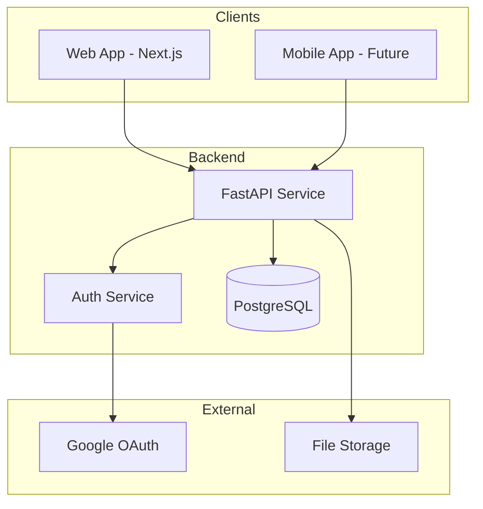

# System Patterns

## Architecture Overview

### System Architecture
Backend-first API design with future web and mobile clients.



### Backend Structure (Functional Cohesion)
```
src/
├── workout_api/
│   ├── __init__.py
│   ├── main.py              # FastAPI app setup
│   ├── config.py            # Settings management
│   ├── database.py          # Database connection
│   ├── auth/                # Auth domain
│   │   ├── models.py        # SQLAlchemy models
│   │   ├── schemas.py       # Pydantic schemas
│   │   ├── service.py       # Business logic
│   │   ├── router.py        # API endpoints
│   │   └── repository.py    # Database queries
│   ├── exercises/           # Exercise domain
│   │   └── (same structure)
│   ├── workouts/            # Workout domain
│   │   └── (same structure)
│   └── shared/              # Minimal shared code
│       ├── base_model.py
│       └── exceptions.py
├── tests/
│   ├── conftest.py          # Test configuration
│   ├── auth/
│   ├── exercises/
│   └── workouts/
├── migrations/              # Atlas migrations
├── scripts/                 # Utility scripts
└── Taskfile.yml            # Task automation
```

## Core Patterns

### Repository Pattern
Encapsulate all database operations:
```python
class ExerciseRepository:
    def __init__(self, session: AsyncSession):
        self.session = session
    
    async def get_by_id(self, id: int) -> Exercise | None:
        result = await self.session.get(Exercise, id)
        return result
    
    async def search(self, query: str) -> list[Exercise]:
        stmt = select(Exercise).where(
            Exercise.name.ilike(f"%{query}%")
        )
        result = await self.session.execute(stmt)
        return result.scalars().all()
```

### Service Layer Pattern
Business logic separate from data access:
```python
class ExerciseService:
    def __init__(self, repo: ExerciseRepository):
        self.repo = repo
    
    async def create_exercise(
        self, 
        user_id: int,
        data: ExerciseCreate
    ) -> Exercise:
        # Business validation
        if await self._exercise_exists(data.name, user_id):
            raise DuplicateError("Exercise already exists")
        
        # Create via repository
        return await self.repo.create(data)
```

### Dependency Injection
FastAPI's DI for clean dependencies:
```python
async def get_exercise_service(
    session: AsyncSession = Depends(get_session),
) -> ExerciseService:
    repo = ExerciseRepository(session)
    return ExerciseService(repo)

@router.get("/exercises")
async def list_exercises(
    service: ExerciseService = Depends(get_exercise_service),
):
    return await service.list_all()
```

### Transaction Pattern
Ensure data consistency:
```python
async def create_workout_with_exercises(
    self,
    user_id: int,
    exercises: list[ExerciseData],
) -> Workout:
    async with self.session.begin():
        workout = await self.repo.create_workout(user_id)
        for exercise in exercises:
            await self.repo.add_exercise_execution(
                workout.id, 
                exercise
            )
        return workout
    # Auto-commit on success, rollback on error
```

### Error Handling Pattern
Consistent error responses:
```python
@router.exception_handler(NotFoundError)
async def not_found_handler(request: Request, exc: NotFoundError):
    return JSONResponse(
        status_code=404,
        content={"error": str(exc), "type": "not_found"}
    )

@router.exception_handler(ValidationError)
async def validation_handler(request: Request, exc: ValidationError):
    return JSONResponse(
        status_code=422,
        content={"error": exc.errors(), "type": "validation"}
    )
```

## Database Patterns

### Async Session Management
```python
async def get_session() -> AsyncGenerator[AsyncSession, None]:
    async with async_session_maker() as session:
        try:
            yield session
            await session.commit()
        except Exception:
            await session.rollback()
            raise
```

### Base Model Pattern
Common fields for all models:
```python
class BaseModel(DeclarativeBase):
    id: Mapped[int] = mapped_column(primary_key=True)
    created_at: Mapped[datetime] = mapped_column(
        server_default=func.now()
    )
    updated_at: Mapped[datetime] = mapped_column(
        server_default=func.now(),
        onupdate=func.now()
    )
```

### Relationship Loading
Explicit loading strategy:
```python
# Eager loading when needed
stmt = select(Workout).options(
    selectinload(Workout.exercise_executions)
        .selectinload(ExerciseExecution.sets)
)

# Lazy loading by default
workout = await session.get(Workout, workout_id)
# Access triggers additional query
executions = await workout.awaitable_attrs.exercise_executions
```

## Testing Patterns

### Transaction Isolation
Tests run in rolled-back transactions:
```python
@pytest.fixture
async def session(db_engine):
    async with db_engine.begin() as conn:
        async with async_session_maker(bind=conn) as session:
            yield session
            await session.rollback()
```

### Test Data Factories
Consistent test data creation:
```python
class ExerciseFactory:
    @staticmethod
    def create(**kwargs) -> Exercise:
        defaults = {
            "name": f"Exercise {uuid4()}",
            "category": "strength",
            "modality": "barbell",
            "is_user_created": False,
        }
        return Exercise(**{**defaults, **kwargs})
```

## API Patterns

### Resource Nesting
Clear parent-child relationships:
```
/workouts/{id}/exercise-executions
/workouts/{id}/exercise-executions/{exec_id}/sets
```

### Consistent Responses
Standardized response format:
```python
class PaginatedResponse(Generic[T]):
    items: list[T]
    total: int
    page: int
    size: int
    
class ErrorResponse:
    error: str
    type: str
    details: dict | None = None
```

### Query Parameters
Consistent filtering/pagination:
```python
class PaginationParams:
    page: int = Query(1, ge=1)
    size: int = Query(20, ge=1, le=100)
    
class ExerciseFilters:
    category: str | None = None
    is_user_created: bool | None = None
    search: str | None = None
```

## Security Patterns

### Authentication Flow
JWT with Google OAuth:
```python
# 1. User initiates Google login
# 2. Redirect to Google OAuth
# 3. Google callback with code
# 4. Exchange code for Google token
# 5. Verify Google token
# 6. Create/update user
# 7. Issue JWT token
# 8. Include JWT in requests
```

### Authorization Pattern
Protect resources by user:
```python
async def get_current_user(
    token: str = Depends(oauth2_scheme),
) -> User:
    # Decode and verify JWT
    # Return user or raise 401

async def require_workout_owner(
    workout_id: int,
    user: User = Depends(get_current_user),
    service: WorkoutService = Depends(get_workout_service),
) -> Workout:
    workout = await service.get_workout(workout_id)
    if workout.user_id != user.id:
        raise ForbiddenError()
    return workout
```

## Development Patterns

### Configuration Management
Environment-based settings:
```python
class Settings(BaseSettings):
    database_url: str
    jwt_secret: str
    google_client_id: str
    google_client_secret: str
    
    model_config = SettingsConfigDict(
        env_file=".env",
        env_file_encoding="utf-8",
    )

settings = Settings()
```

### Task Automation
Common commands via Taskfile:
```yaml
version: '3'

tasks:
  dev:
    desc: Run development server
    cmds:
      - uvicorn workout_api.main:app --reload
  
  test:
    desc: Run tests
    cmds:
      - pytest {{.CLI_ARGS}}
  
  migrate:
    desc: Run migrations
    cmds:
      - atlas migrate apply --env local
```

## Performance Patterns

### Connection Pooling
Reuse database connections:
```python
engine = create_async_engine(
    settings.database_url,
    pool_pre_ping=True,
    pool_size=10,
    max_overflow=20,
)
```

### Pagination
Prevent large result sets:
```python
async def paginate(
    query: Select,
    page: int,
    size: int,
) -> tuple[list[T], int]:
    # Get total count
    count_stmt = select(func.count()).select_from(query.subquery())
    total = await session.scalar(count_stmt)
    
    # Get page of results
    results = await session.execute(
        query.offset((page - 1) * size).limit(size)
    )
    return results.scalars().all(), total
```

### Caching Strategy (Future)
- Redis for session storage
- Cache user preferences
- Cache exercise database
- Invalidate on updates 